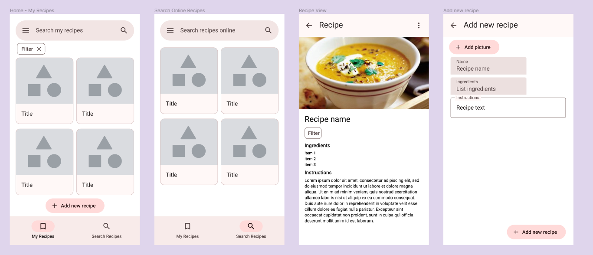

# AppRecipes
App for searching recipes online and saving them locally.

## Design made in Figma


## Setup
To use this app, you need to provide your own Spoonacular API key.
In `network` package, create `ApiKeys.kt` and an object with value `SPOONACULAR_API_KEY`.
```
object ApiKeys {
  const val SPOONACULAR_API_KEY: String = *put your key here*
}
```
